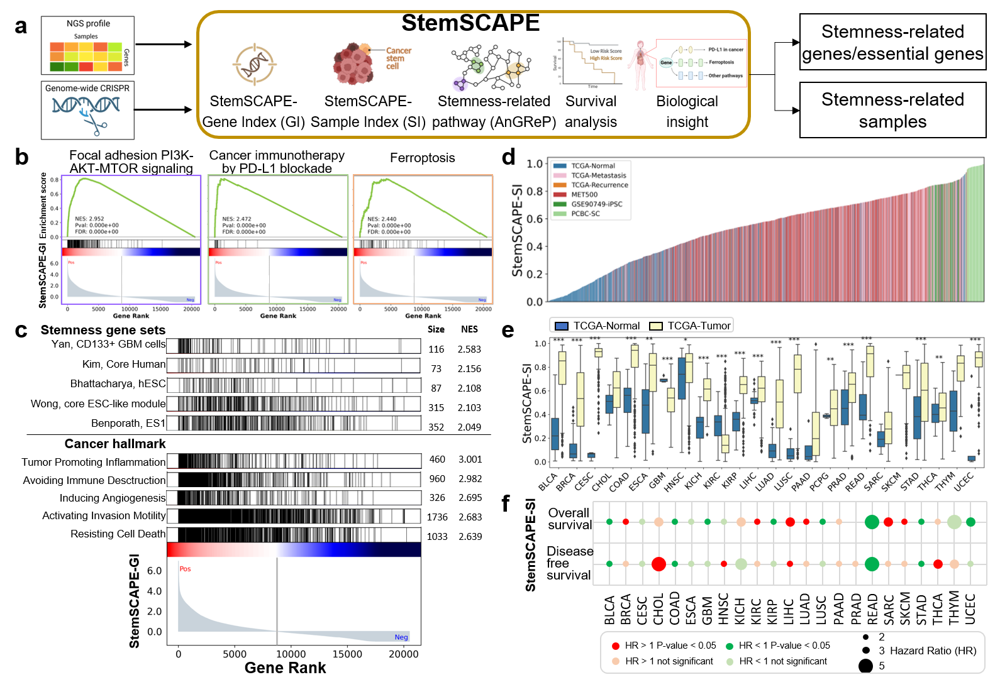
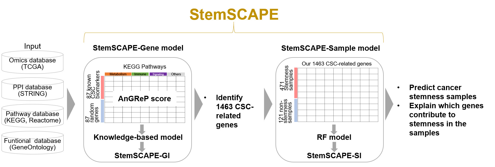

# StemSCAPE
Visible Machine Learning Maps Cancer Stemness Landscape


**Development and validation of StemSCAPE framework.**


This repository hosts the source code used for the data processing within our study, alongside all relevant raw data/files. For comprehensive details regarding the methodology, please refer to
> Visible Machine Learning Maps Cancer Stemness Landscape
>
> Jung-Yu Lee, Chih-Yuan Chou, Yen-Lin Chen, Yao-Feng Li, Yun-Ti Chen, Chun-Yu Lin, Chia-Hwa Lee, Jinn-Moon Yang

## Description

**Overview of StemSCAPE framework.**

## Data sources

The cancer stemness-associated genes (n=87 literature-reported) were curated from the following four references:

- 30 cancer-stemness genes were downloaded from [Yang et al., _Signal Transduct Tar_, 2020](https://doi.org/10.1038/s41392-020-0110-5)
- 43 cancer-stemness genes were downloaded from [Walcher et al., _Front Immunol_, 2020](https://doi.org/10.3389/fimmu.2020.01280)
- 43 cancer-stemness genes were downloaded from [Nagle et al., _Radiation Oncology_, 2019](https://doi.org/10.1007/978-3-319-52619-5_104-1)
- 42 cancer-stemness genes were downloaded from [Zhao et al, _Cancer Transl Med_, 2017](https://doi.org/10.4103/ctm.ctm_69_16)

The testing datasets were curated from the following three references:

- [100 cancer-stemness genes](http://www.bio-bigdata.center/CellMarkerSearch.jsp?quickSearchInfo=stem%20cell&index_key=2#framekuang) were downloaded from CellMarker 2.0 by [Hu et al., _Nucleic Acids Res_, 2023](https://doi.org/10.1093/nar/gkac947)
- [131 normal-stemness genes](http://www.bio-bigdata.center/CellMarkerSearch.jsp?quickSearchInfo=stem%20cell&index_key=2#framekuang) were downloaded from CellMarker 2.0 by [Hu et al., _Nucleic Acids Res_, 2023](https://doi.org/10.1093/nar/gkac947)
- [69 high confidience cancer-stemness genes](https://bicresources.jcbose.ac.in/ssaha4/bcscdb/download.php) were downloaded from BCSCdb by [Firdous et al., _Database-Oxford_, 2022](https://doi.org/10.1093/database/baac082)

## Installation and setup
### Project dependencies
This project uses `Python` version 3.10.14.

The following `Python` packages are used in this repository:
- `numpy` (v1.26.4)
- `pandas` (v2.2.1)
- `scikit-learn` (v1.3.0)
- `shap` (v0.45.1)


### Project initialization
```bash
git clone https://github.com/bioxgem/StemSCAPE.git

cd StemSCAPE
```
## Usage instructions
```bash
python StemSCAPE-SI.py \
    -i ./StemSCAPE-SI_Input/TCGA_and_GSE30652_1344genes_for_training.txt \
    -e ./StemSCAPE-SI_Input/TCGA_others-1_1344genes_for_testing.txt \   
    -l Label \   
    -s Sample \ 
    -o ./StemSCAPE-SI_Output/TCGA_SHAP    
```

## Contact Information

All technical questions pertaining to the StemSCAPE datasets and associated scripts should be directed to [BioXGEM](https://bioxgem.life.nctu.edu.tw/bioxgem/).

We appreciate your interest in our published work.
